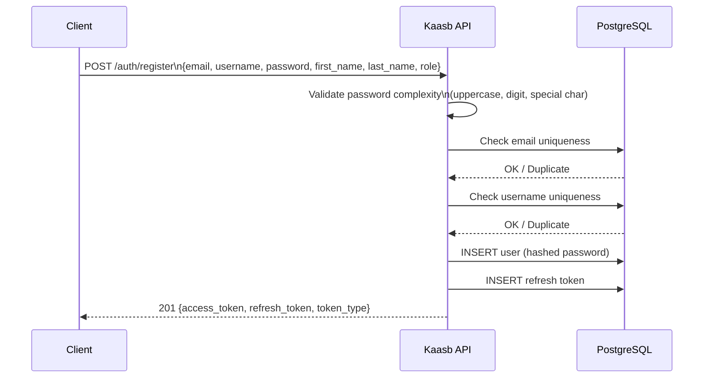
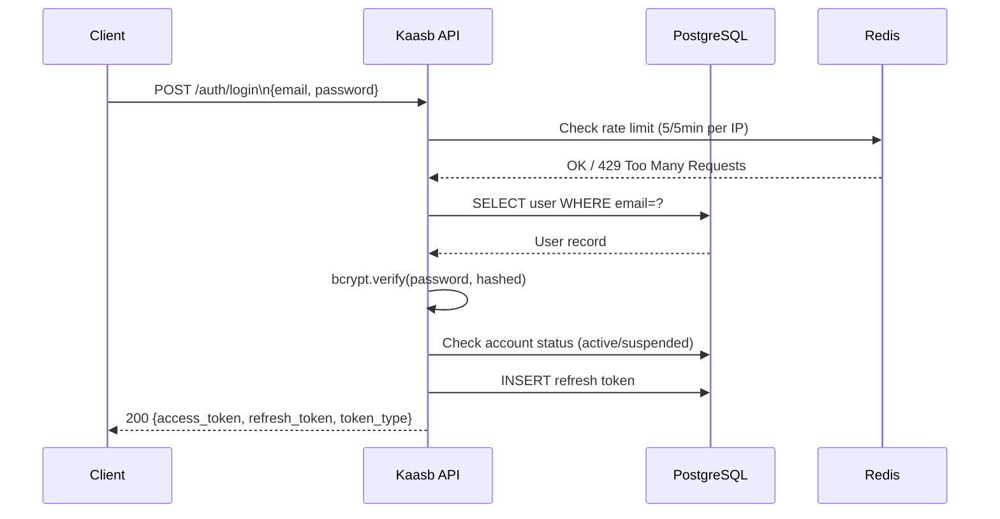
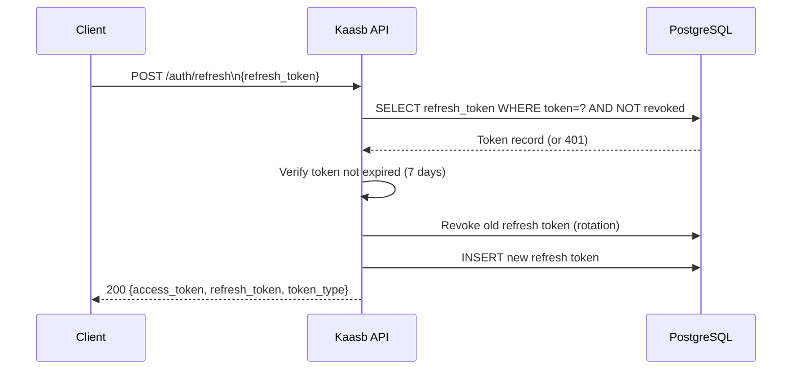
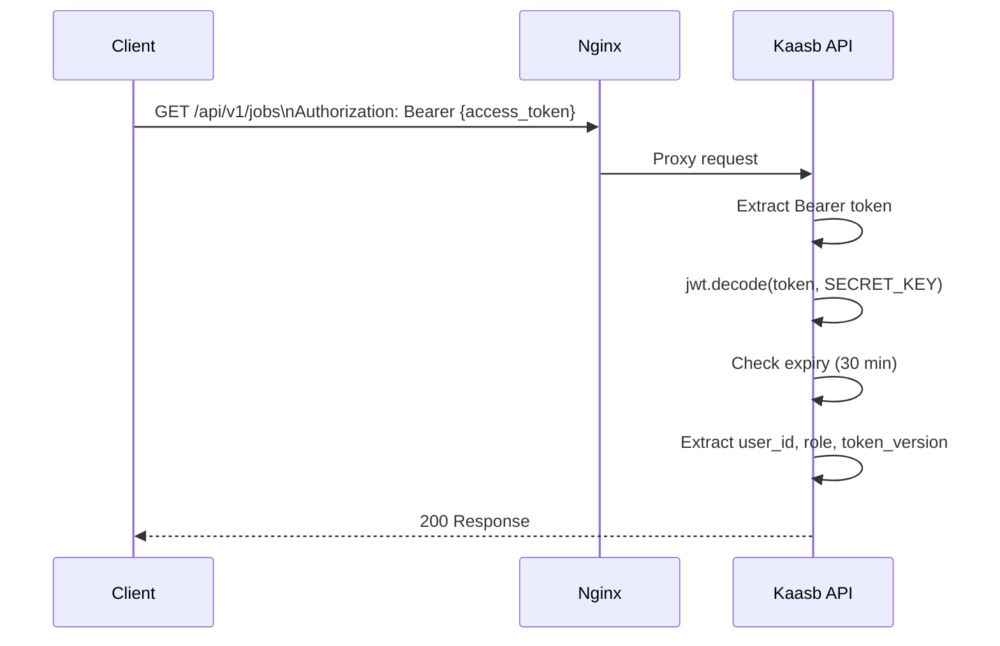

# Kaasb API — Authentication & Authorization

## Overview

Kaasb uses **JWT (JSON Web Token)** authentication with a dual-token strategy:

| Token | TTL | Storage | Purpose |
|-------|-----|---------|---------|
| Access Token | 30 minutes | Memory / Authorization header | Authenticate API requests |
| Refresh Token | 7 days | httpOnly cookie / body | Obtain new access tokens |

Tokens are signed with HS256 using `SECRET_KEY`. Rotating the secret key invalidates all sessions.

---

## Authentication Flows

### 1. Registration Flow



### 2. Login Flow



### 3. Token Refresh Flow



### 4. Authenticated Request Flow



---

## Sending the Access Token

```bash
# In Authorization header (recommended)
curl -H "Authorization: Bearer eyJhbGc..." https://kaasb.com/api/v1/auth/me
```

```python
# Python (requests)
import requests

headers = {"Authorization": f"Bearer {access_token}"}
resp = requests.get("https://kaasb.com/api/v1/auth/me", headers=headers)
```

```javascript
// JavaScript (fetch)
const resp = await fetch("https://kaasb.com/api/v1/auth/me", {
  headers: { "Authorization": `Bearer ${accessToken}` }
});
```

---

## Auto-Refresh Strategy (Frontend Pattern)

```javascript
// Axios interceptor — automatically refreshes expired tokens
import axios from "axios";

const api = axios.create({ baseURL: "https://kaasb.com/api/v1" });

api.interceptors.response.use(
  (response) => response,
  async (error) => {
    const original = error.config;
    if (error.response?.status === 401 && !original._retry) {
      original._retry = true;
      try {
        const { data } = await axios.post("/auth/refresh", {
          refresh_token: localStorage.getItem("refresh_token")
        });
        localStorage.setItem("access_token", data.access_token);
        localStorage.setItem("refresh_token", data.refresh_token);
        original.headers["Authorization"] = `Bearer ${data.access_token}`;
        return api(original);
      } catch {
        // Refresh failed — redirect to login
        window.location.href = "/auth/login";
      }
    }
    return Promise.reject(error);
  }
);
```

---

## Role-Based Access Control

### Roles

| Role | Description | Key Permissions |
|------|-------------|----------------|
| `client` | Posts jobs and hires freelancers | Create jobs, respond to proposals, fund escrow, leave reviews |
| `freelancer` | Applies for jobs and delivers work | Submit proposals, start/submit milestones, request payouts |
| `admin` | Platform administrator | All client/freelancer permissions + admin endpoints |

### Permission Matrix

| Action | Anonymous | Client | Freelancer | Admin |
|--------|-----------|--------|------------|-------|
| Browse jobs | ✅ | ✅ | ✅ | ✅ |
| Browse freelancers | ✅ | ✅ | ✅ | ✅ |
| View user profile | ✅ | ✅ | ✅ | ✅ |
| Post a job | ❌ | ✅ | ❌ | ✅ |
| Submit proposal | ❌ | ❌ | ✅ | ✅ |
| Respond to proposal | ❌ | ✅ (own jobs) | ❌ | ✅ |
| View contract details | ❌ | ✅ (participant) | ✅ (participant) | ✅ |
| Start/submit milestone | ❌ | ❌ | ✅ (assigned) | ✅ |
| Approve milestone | ❌ | ✅ (own contract) | ❌ | ✅ |
| Fund escrow | ❌ | ✅ | ❌ | ✅ |
| Request payout | ❌ | ❌ | ✅ | ✅ |
| Admin endpoints | ❌ | ❌ | ❌ | ✅ |

---

## Token Format

JWT payload structure:
```json
{
  "sub": "550e8400-e29b-41d4-a716-446655440000",
  "role": "freelancer",
  "token_version": 1,
  "exp": 1711569600,
  "iat": 1711567800
}
```

| Claim | Description |
|-------|-------------|
| `sub` | User UUID |
| `role` | `client`, `freelancer`, or `admin` |
| `token_version` | Incremented on password change — invalidates old tokens |
| `exp` | Expiry timestamp (Unix) |
| `iat` | Issued-at timestamp (Unix) |

---

## Security Notes

- **Never store tokens in localStorage** in production — use httpOnly cookies or memory
- **Rotate refresh tokens** on each use (already implemented) — prevents replay attacks
- **Token version** in JWT means password changes invalidate all existing access tokens at natural expiry
- **Logout all** (`POST /auth/logout-all`) increments `token_version` — all access tokens immediately invalid on next DB check

---

## cURL Examples

```bash
# Register
curl -X POST https://kaasb.com/api/v1/auth/register \
  -H "Content-Type: application/json" \
  -d '{"email":"test@example.com","username":"testuser","password":"Pass1!abc","first_name":"Test","last_name":"User","primary_role":"freelancer"}'

# Login
curl -X POST https://kaasb.com/api/v1/auth/login \
  -H "Content-Type: application/json" \
  -d '{"email":"test@example.com","password":"Pass1!abc"}'

# Use access token
curl https://kaasb.com/api/v1/auth/me \
  -H "Authorization: Bearer YOUR_ACCESS_TOKEN"

# Refresh
curl -X POST https://kaasb.com/api/v1/auth/refresh \
  -H "Content-Type: application/json" \
  -d '{"refresh_token":"YOUR_REFRESH_TOKEN"}'

# Logout
curl -X POST https://kaasb.com/api/v1/auth/logout \
  -H "Authorization: Bearer YOUR_ACCESS_TOKEN"
```
